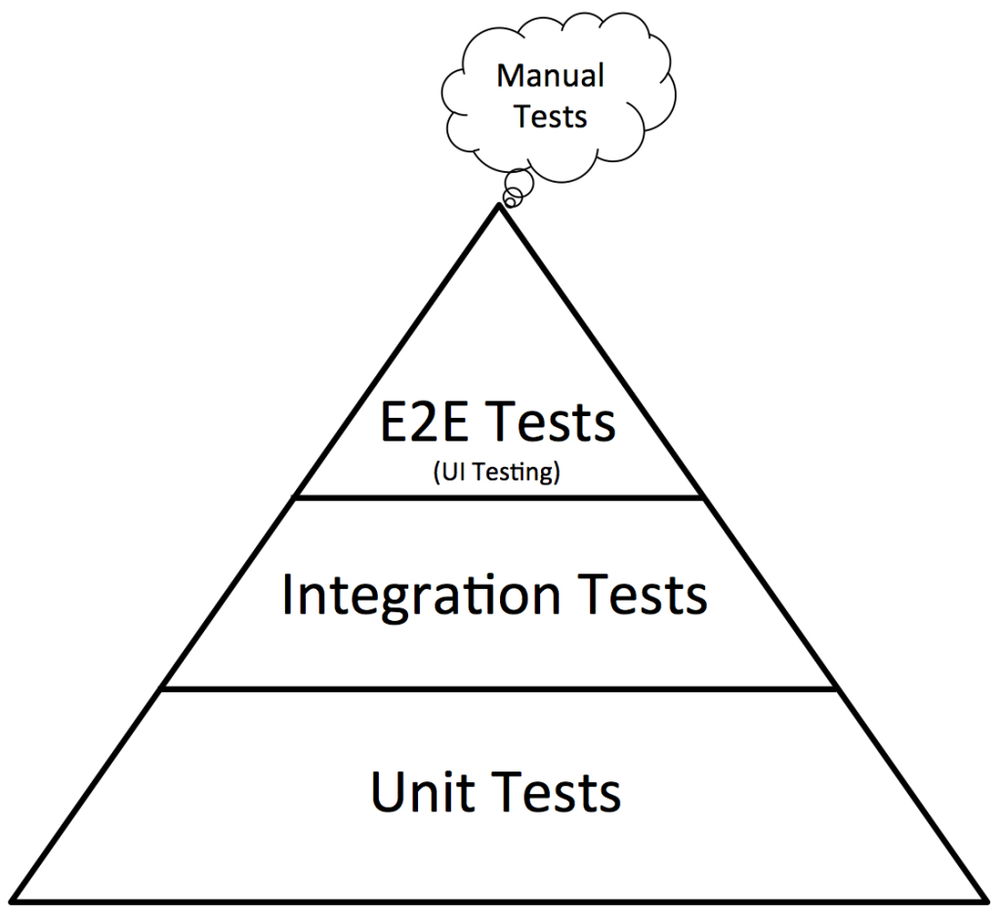

# ledger-challenge

## Quick start

Run locally with Makefile:

```shell
make run #run system
make acceptance-tests #run tests
```

## Tests
Use [robotframwork](https://robotframework.org/) for UI and Integration tests.



Run locally _(require Python3 with pip)_:

```shell
pip install robotframework
robot --version
robot --pythonpath . tests
```

Run with docker _(require Docker)_:
```shell
docker build -t ledger-tests -f build/tests.Dockerfile .
docker run --rm -v $(pwd)/test:/test ledger-tests bash -c "robot --outputdir /test/output /test"
```

## 